<p align="center">
  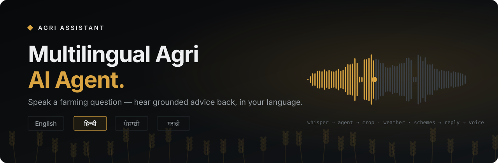
</p>

<p align="center">
  <a href="https://farmer-advisory-voice-agent.onrender.com"></a>
  <a href="https://colab.research.google.com/github/sehscape/Multilingual-Agri-AI-Agent/blob/main/notebooks/run_full_app_colab.ipynb"></a>
  <a href="#-quality--results"></a>
</p>

<p align="center">
  
  
  
  
  
  
  
</p>

<p align="center">
  <b>A voice-enabled farming assistant powered by RAG, LLMs and real-time weather intelligence.</b><br>
  Pick a language, tap the mic, ask about your crop, the weather over your field or a government scheme —<br>
  and hear a short, grounded answer back in <b>English, हिन्दी, ਪੰਜਾਬੀ or मराठी</b>.
</p>

<p align="center">
  <a href="#-see-it-in-action">Demo</a> ·
  <a href="#-how-it-works">How it works</a> ·
  <a href="#-architecture">Architecture</a> ·
  <a href="#-quality--results">Results</a> ·
  <a href="#-quick-start">Quick start</a> ·
  <a href="#-deployment">Deploy</a> ·
  <a href="#-engineering-notes">Engineering notes</a>
</p>

---

## 🌾 Why I built this

India has 140+ million farming households. Good advice exists — crop calendars,
weather services, government schemes — but it sits in long English or Hindi
documents and portals. For a farmer who speaks only Marathi or Punjabi, or who
doesn't read comfortably, "go read the PM-KISAN guidelines" is not help.

So the whole product is built around one idea: **asking out loud and listening
should be enough.** Every message on screen is also spoken, the answer comes
back in the language the farmer picked, and the assistant asks back instead of
guessing when something is missing.

The second idea matters just as much: **the AI is never the source of facts.**
Fertilizer doses come from a curated crop knowledge base, weather from a live
API, scheme rules from the official documents. The language model only
understands the question and *phrases* what the tools found. If nothing
reliable is found, it says so — a wrong dose can cost a farmer a season.

## 📸 See it in action

<p align="center">
  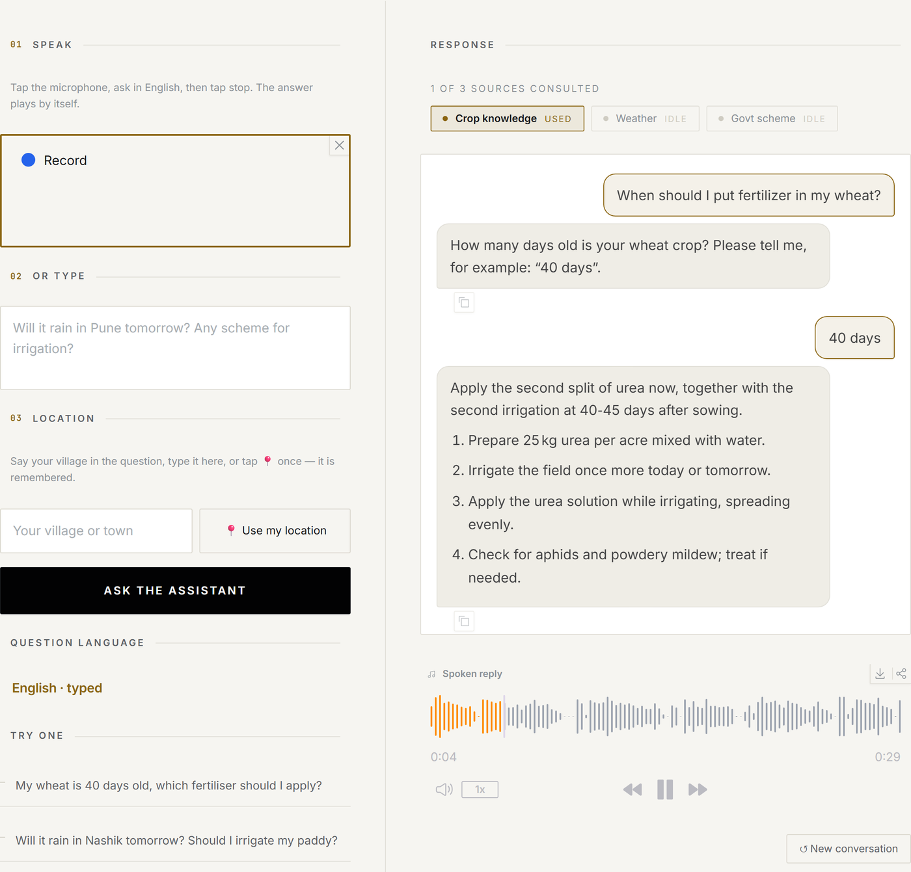
</p>
<p align="center"><sub>The assistant needs the crop's age before it can advise on fertilizer, so it asks. The farmer answers “40 days”, and the earlier question is completed from memory.</sub></p>

<table>
  <tr>
    <td width="58%" align="center">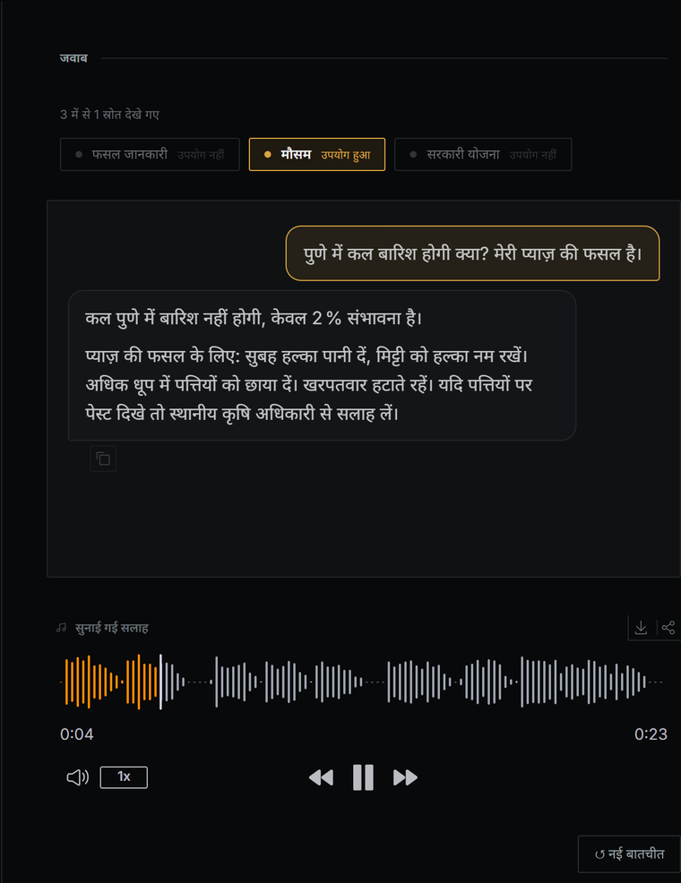</td>
    <td width="42%" align="center">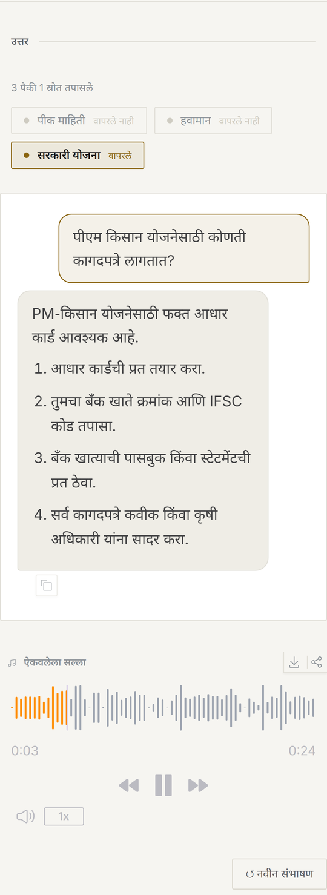</td>
  </tr>
  <tr>
    <td align="center"><sub><b>Hindi, dark mode</b> — live Pune forecast via Open-Meteo, answered and spoken in Hindi</sub></td>
    <td align="center"><sub><b>Marathi, on a phone</b> — PM-KISAN documents, retrieved from the scheme text</sub></td>
  </tr>
</table>

A real exchange, spoken in Hindi:

> 👨‍🌾 *"गेहूं में खाद कब डालें?"* — *When should I put fertilizer on my wheat?*
> 🔊 *"आपकी गेहूं की फसल कितने दिन की है? कृपया बताइए, जैसे: 40 दिन।"* — *How many days old is your wheat?*
> 👨‍🌾 *"40 दिन"*
> 🔊 *"गेहूं की 40 दिन की उम्र पर, दूसरी सिंचाई के साथ दूसरा यूरिया (25 kg/एकड़) डालें…"* — *At 40 days, apply the second urea dose (25 kg/acre) with the second irrigation…*

**The chosen language always wins.** Ask in English with Hindi selected and the
answer comes back in Hindi; the microphone also listens *for* that language
instead of guessing it.

## ✨ Highlights

| | |
|---|---|
| 🎙️ **Voice-first, 4 languages** | Whisper-large-v3 with the language forced to the farmer's choice; the whole interface (78 messages) switches between English, Hindi, Punjabi and Marathi |
| 💬 **A real conversation** | Chat thread with a typing indicator; follow-ups like *"40 days"* or *"Nashik"* complete the question that was asked back |
| 🧭 **Agentic tool use** | A LangChain ReAct `AgentExecutor` picks only the tools a question needs — crop knowledge, live weather, scheme search — with a deterministic fallback |
| 📚 **Grounded RAG with refusal** | Scheme answers come from retrieved passages; below a 0.30 relevance score it answers *"the documents don't cover this"* instead of guessing |
| ❓ **Asks back, never guesses** | Missing crop, missing age, impossible age (*wheat, 300 days*), unknown place, unsupported crop — each gets a clear spoken question |
| ⚡ **Words first, voice next** | The answer appears in a median **2.5 s**; the recording follows as a separate step, so the farmer can already ask again |
| 📱 **Made for phones** | Language and village remembered on the device, 📍 GPS for weather, auto-send when you tap stop, dark mode |
| 🆓 **Runs on a free 512 MB host** | A *Lite* build drops PyTorch entirely and hands listening and language work to Groq's free API — ~170 MB RAM |

## 🧠 How it works

One question, end to end. Everything the pipeline learns travels in a single
`AgentState` object, including `response_language` — the language the farmer
picked, which every step respects.

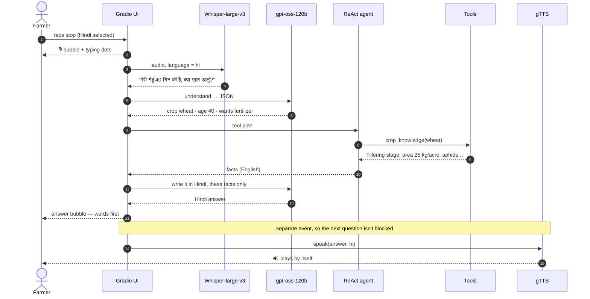

## 🏗 Architecture

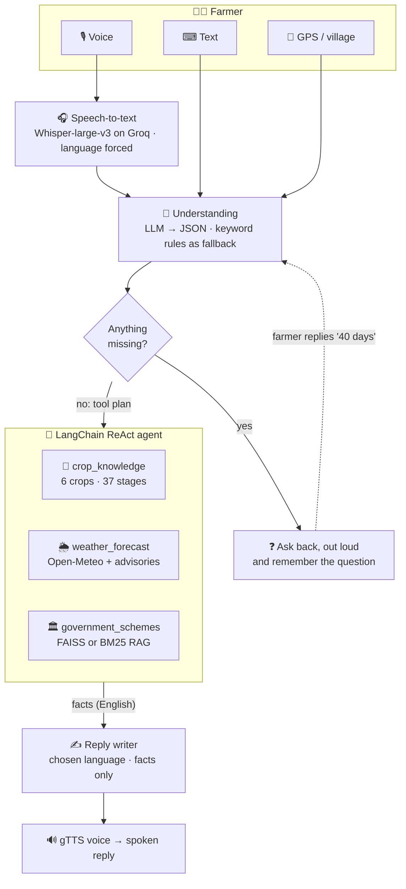

**Key design choice:** the tools work in English, and language only matters at
the edges — when the farmer's words come in and when the answer goes out. That
keeps the knowledge base single-language and lets every new language reuse all
of it.

<details>
<summary><b>Asking back — the clarify step as a state machine</b></summary>

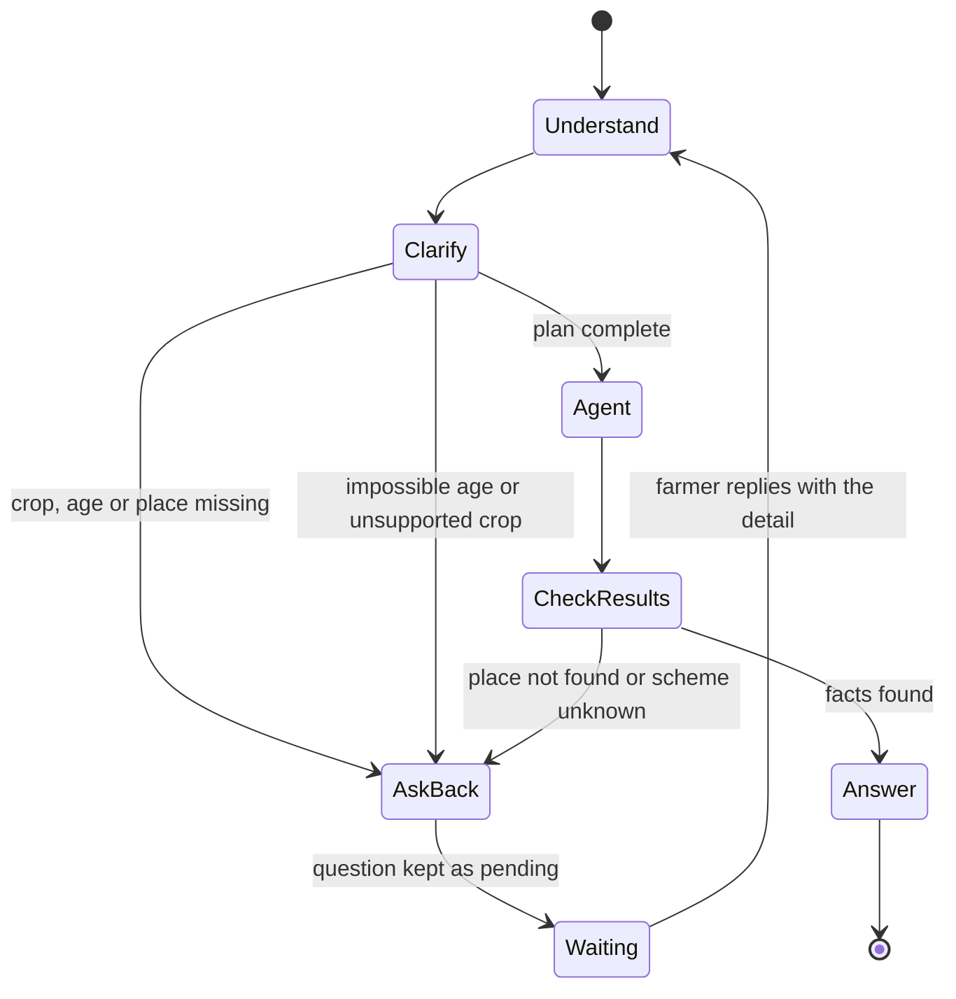

If only *part* of a question can be answered (say the weather, but not the
fertilizer dose without the crop's age), the assistant answers that part and
adds the missing-detail question at the end.
</details>

<details>
<summary><b>Scheme search — retrieval with a refusal threshold</b></summary>

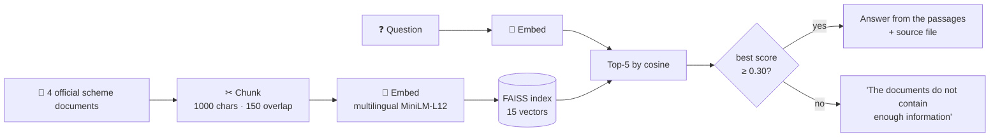

On the free host there is no room for an embedding model, so a pure-Python
**BM25** index takes over (`RAG_BACKEND=bm25`) with two extra rules: a boost
when a word matches the scheme's own name, and the best chunk must match **at
least two different words** of the question — one accidental hit is not trusted.
</details>

<details>
<summary><b>Answer language — a fallback ladder that never shows the wrong script</b></summary>

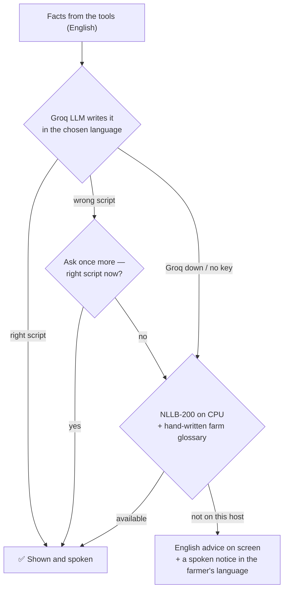
</details>

### Three ways it runs

| | 💻 Laptop + Groq key | 💻 Laptop, no key | ☁️ Render free (Lite) + Groq key |
|---|---|---|---|
| **Voice questions** | Groq Whisper-large-v3 | local Whisper-small | Groq Whisper-large-v3 |
| **Understanding** | Groq LLM | keyword rules (Hindi / Marathi / Punjabi farm words) | Groq LLM |
| **Answer in chosen language** | Groq LLM writes it | NLLB-200 translates (6–8 s) | Groq LLM writes it |
| **Scheme search** | FAISS (semantic) | FAISS (semantic) | BM25 (keyword) |
| **Memory** | ~3–4 GB | ~3–4 GB | **~170 MB** |

The device is auto-detected (`app/utils/device.py`): CUDA + float16 on a GPU,
CPU + float32 otherwise — no code change.

## 🛡 How it stays honest

| Guardrail | Where | What it prevents |
|---|---|---|
| Facts only from tools | the whole design | The LLM inventing doses, prices or rules |
| "Use only these facts" answer prompt, temperature 0 for understanding | `agents/reply_writer.py`, `agents/understanding.py` | Creative additions, inconsistent parsing |
| Relevance threshold 0.30 → refusal | `tools/scheme_tool.py` | Answering scheme questions from weak matches |
| BM25 two-word rule | `rag/keyword_retriever.py` | Trusting one accidental keyword hit |
| Ask-backs + impossible-age check | `agents/clarify.py` | Guessing a crop's stage, or advising on "wheat, 300 days" |
| Hand-written farm glossary | `models/agri_glossary.py` | "Tillering" being machine-translated as "harvest" |
| Range rewriting before translation | `models/translation.py` | "3–5 cm" of water turning into "35 cm" |
| Script check + one retry | `agents/reply_writer.py` | Punjabi shown in the wrong alphabet |
| Escaped user text, key never logged | `ui/gradio_app.py`, `models/groq_client.py` | HTML injection; leaking the API key |

## 📊 Quality & results

<p align="center">
  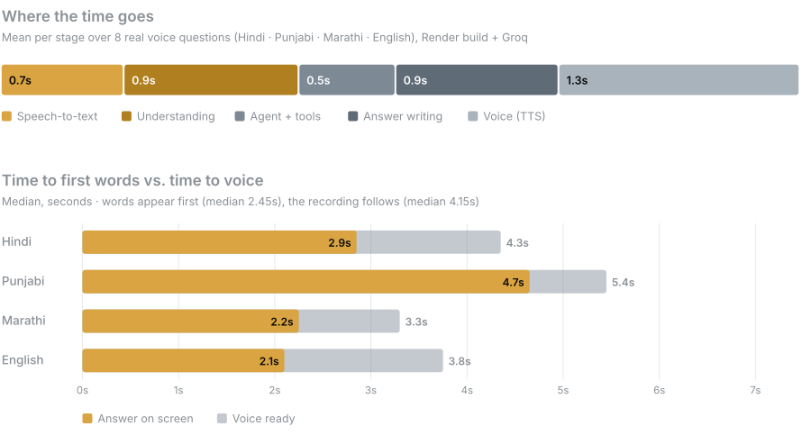
</p>

<sub>Measured with <code>python scripts/benchmark_latency.py --rounds 2</code> — 8 real spoken questions through the Render build with Groq. Punjabi is slowest because its question needs the live weather call.</sub>

**Evaluation** (`python scripts/evaluate.py`, built-in test set):

| Metric | Score |
|---|---|
| Intent classification | **100%** (10/10) |
| Tool selection | **100%** (10/10), no unnecessary tools |
| Scheme retrieval, top-1 source | **100%** (4/4), mean relevance 0.60 |
| Off-topic refusal | **100%** (2/2) |
| Answers grounded · actionable · cite a source | **100%** |

> The test set is small, so these numbers show the pipeline is wired correctly
> end to end — they are not a claim about real-world accuracy.

**Automated checks** — every part has its own test script, plus a `pytest` suite:

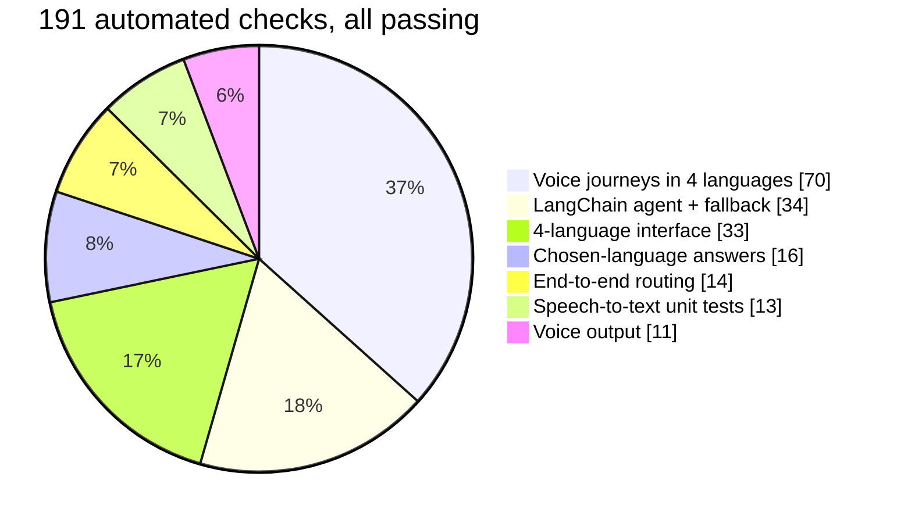

| Script | What it proves |
|---|---|
| `test_voice_languages.py` | The Render build with a faked Groq: voice in 4 languages, every ask-back, failure paths, the chat thread |
| `test_langchain_agent.py` | The agent picks exactly the right tools for 9 intents; the fallback takes over when the agent misbehaves |
| `test_i18n.py` | Every string exists in all 4 languages; switching language re-renders the page |
| `test_language_consistency.py` | The chosen language wins; glossary terms survive; "3–5 cm" never becomes "35" |
| `test_e2e_phase9.py` | Every intent is routed to the right tools; odd and empty inputs don't crash |
| `test_lite_mode.py` | The free-host build runs with PyTorch and friends absent |
| `test_weather_phase6.py` · `test_scheme_phase7.py` | Live weather and scheme retrieval, including graceful failures |
| `test_groq_live.py` | The same journeys against the real Groq API with your key |

## 🧰 Tech stack

| Layer | Technology |
|---|---|
| **Interface** | [Gradio](https://gradio.app) 6.26 — chat thread, browser mic, GPS, light/dark themes, 4-language i18n |
| **Agent** | [LangChain](https://python.langchain.com) ReAct `AgentExecutor` with 3 tools · deterministic sequential orchestrator as fallback |
| **Speech-to-text** | [Whisper](https://github.com/openai/whisper) large-v3 via [Groq](https://console.groq.com) · Whisper-small locally |
| **Understanding + answers** | Open-weight [gpt-oss-120b](https://huggingface.co/openai/gpt-oss-120b) on Groq, falling back to gpt-oss-20b → Llama 3.3 70B · rule-based router offline |
| **Retrieval** | [paraphrase-multilingual-MiniLM-L12-v2](https://huggingface.co/sentence-transformers/paraphrase-multilingual-MiniLM-L12-v2) + [FAISS](https://github.com/facebookresearch/faiss) · pure-Python BM25 on the free host |
| **Translation (offline)** | [NLLB-200 distilled 600M](https://huggingface.co/facebook/nllb-200-distilled-600M) + hand-written glossary · [IndicTrans2](https://github.com/AI4Bharat/IndicTrans2) optional |
| **Weather** | [Open-Meteo](https://open-meteo.com) geocoding + forecast (free, no key) |
| **Text-to-speech** | [gTTS](https://github.com/pndurette/gTTS), chunks fetched in parallel · [indic-parler-tts](https://huggingface.co/ai4bharat/indic-parler-tts) optional on GPU |
| **Hosting** | [Render](https://render.com) free tier (Lite build) · Google Colab (full build) |

**Knowledge base:** wheat, rice, onion, tomato, cotton and maize (37 growth
stages with irrigation, fertilizer, pest and tip notes, crop names recognised in
all four scripts) and four schemes — PM-KISAN, PM Fasal Bima Yojana, Kisan
Credit Card and Soil Health Card.

## 🚀 Quick start

**Prerequisites:** Python 3.11, no GPU needed. A free [Groq API key](https://console.groq.com) is optional but turns on voice and the best answers in all four languages.

```bash
git clone https://github.com/sehscape/Multilingual-Agri-AI-Agent.git
cd Multilingual-Agri-AI-Agent
python -m venv venv
```

```bash
# Windows: venv\Scripts\activate    ·    Linux / macOS:
source venv/bin/activate
pip install -r requirements.txt
cp .env.example .env              # then put your key in GROQ_API_KEY
python scripts/build_scheme_index.py   # one time: builds the FAISS index
python app.py
```

Open <http://127.0.0.1:7860>. Models load in the background on startup (15–35 s).
The grey line under the headline shows exactly what's switched on, e.g.
`full · voice groq whisper-large-v3 · llm groq openai/gpt-oss-120b · agent langchain · rag faiss · tts gtts · 4 languages`.

<details>
<summary><b>Configuration</b> — every setting is read from <code>.env</code> by <code>app/config.py</code></summary>

| Variable | Default | What it does |
|---|---|---|
| `GROQ_API_KEY` | — | Turns on Groq Whisper and the Groq LLM (voice + 4-language answers) |
| `GROQ_LLM_MODELS` | `openai/gpt-oss-120b,openai/gpt-oss-20b,llama-3.3-70b-versatile` | Models tried in order; over-limit ones are skipped |
| `LITE_MODE` | `false` | `true` on the 512 MB host: no PyTorch, BM25 search |
| `AGENT_BACKEND` | `langchain` | `langchain` (ReAct) or `sequential` |
| `RAG_BACKEND` | `faiss` | `faiss` (semantic) or `bm25` (keyword) |
| `RAG_MIN_SCORE` · `TOP_K` | `0.30` · `5` | Retrieval threshold and depth |
| `STT_BACKEND` | `auto` | `auto`, `groq` or `local` |
| `TRANSLATION_ENGINE` | `nllb` | Offline translator when Groq can't write the answer |
| `TTS_ENGINE` | `gtts` | `gtts`, `parler` (GPU) or `stub` |
| `DEV_MODE` | `true` (`false` in Lite) | Shows the full pipeline trace in the *Transcript & pipeline* panel |

On Windows, set `PYTHONUTF8=1` so test scripts print Devanagari and Gurmukhi cleanly.
</details>

## ☁️ Deployment

| Path | Cost | Always on | What you get |
|---|---|---|---|
| **Render — Lite** (`render.yaml`) | Free | ✅ sleeps when idle | Mic + answers in all 4 languages with `GROQ_API_KEY`; typed English without it |
| **Google Colab** (`notebooks/run_full_app_colab.ipynb`) | Free | while the tab is open | Everything, including semantic search and a local LLM |
| **Any 2 GB+ host** (`LITE_MODE=false`) | Paid | ✅ | Everything, plus the offline fallbacks |

[](https://render.com/deploy?repo=https://github.com/sehscape/Multilingual-Agri-AI-Agent)

Render reads `render.yaml`, installs `requirements-lite.txt` (no PyTorch) and
asks for `GROQ_API_KEY` — paste it into Render's environment settings, never into
the code. Step-by-step guide, free-tier limits and troubleshooting:
**[DEPLOY.md](DEPLOY.md)**.

## 🔧 Engineering notes

The problems that took the most thought, and what I did about them:

| Problem | Why it happened | Fix |
|---|---|---|
| Render's free tier couldn't hold the models | 512 MB RAM vs. several GB for Whisper + embeddings + translator | A `LITE_MODE` build: no PyTorch, BM25 search, Groq for listening and language — ~170 MB |
| Whisper misheard short Hindi clips as other languages | Auto-detection is unreliable on a few seconds of speech | Force the language the farmer picked, and give Groq Whisper a farm-word prompt |
| Local Whisper looped "अगर अगर अगर…" for ~40 s | A known repetition failure on CPU | Length cap, repetition penalty and a degenerate-output detector — and a "please speak again" |
| NLLB translated "tillering" as "harvest" and "3–5 cm" as "35 cm" | A general model doesn't know farm terms and drops dashes | Growth stages and headings come from a hand-written glossary; ranges are rewritten as "3 to 5" first |
| The voice took 11.5 s | gTTS accepts ~100 characters per request | Split the text and fetch the pieces in parallel → ~1.3 s |
| A follow-up asked while the voice was being made was silently dropped | Words and voice shared one event, so the page stayed "busy" | Words and voice are separate events; a newer question makes a late recording stand down |
| Loading spinners stacked on top of the answer | Gradio draws an overlay on every output of a running event | A chat thread with its own typing bubble; overlays off |
| The page scrolled sideways on phones | The audio waveform is drawn at fixed pixels per second | `contain: inline-size` on the player and thread; phone gutters set outside Gradio's CSS rewriting |
| IndicTrans2 tooling wouldn't install on Windows | It needs the MSVC build tools | A pure-Python replacement for the text processor (`indic_processor.py`) |

## 📁 Project structure

```
├── app/
│   ├── agents/       understanding, clarify (ask-backs), LangChain agent, orchestrator,
│   │                 answer writing, shared AgentState
│   ├── models/       speech-to-text, text-to-speech, LLMs, Groq client,
│   │                 translation (NLLB / IndicTrans2), farm glossary, embeddings
│   ├── rag/          FAISS scheme search · BM25 keyword search
│   ├── tools/        crop, weather and scheme tools
│   ├── ui/           Gradio screen + every message in 4 languages (i18n.py)
│   ├── utils/        logging, audio conversion, device detection
│   ├── config.py     every setting, read from .env
│   └── main.py       starts the app
├── data/
│   ├── crops/        one JSON file per crop — stages and advice
│   └── schemes/raw/  government scheme documents
├── notebooks/        Colab notebook for the full app
├── scripts/          test scripts, evaluation, latency benchmark, index builder
├── tests/            pytest unit tests
├── assets/           README images
├── app.py            entry point
├── render.yaml       Render blueprint (Lite build)
├── requirements.txt       full build
└── requirements-lite.txt  free-host build (no PyTorch)
```

## 🧭 Limitations & roadmap

**Known limitations**
- Groq's free plan allows roughly 50–60 full answers a day on gpt-oss-120b before it falls back to smaller models; everyone on the live link shares one key.
- Voice clips and question text go to Groq (GPS coordinates only go to the weather service). A production version should self-host.
- The LLM occasionally adds a harmless-sounding step that isn't in the crop data.
- The knowledge base is small: 6 crops and 4 schemes. gTTS needs internet and has one voice per language.

**Next**
- [ ] Check every number in an answer against the source facts before speaking it
- [ ] More crops and schemes, ingested from the official PDFs with page-level citations
- [ ] Pest and disease names in the translation glossary
- [ ] Self-hosted Whisper + an open LLM on a GPU, and a more natural Indic voice
- [ ] Shareable `?lang=hi` links for a pre-set language

---

<p align="center">
  Built by <a href="https://github.com/sehscape"><b>Sehal Chodankar</b></a> · MIT licensed<br>
  <sub>Made so that the best farming advice is one spoken question away — in any language, for anyone who can talk.</sub>
</p>
